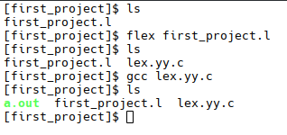
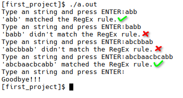

<div dir="rtl">

# پروژه اول

## توضیحاتی درباره‌ی LEX

### نمونه کد

</div>

```c
/* Auxiliary declarations */
%{
    #include <that_library.h>

    int global_variable1;
    int global_variable2;

    int auxiliary_function1();
    int auxiliary_function2();    
    int auxiliary_function3();
%}

/* Regular definitions */
Number [0-9]
LETTER [a-zA-Z]

/* Rules */
%%
Rule1 {auxiliary_function1();}
Rule2 {auxiliary_function2();}
Rule3
Rule4   {auxiliary_function3();}
%%

/* Auxiliary functions */
int yywrap(){}
int main(){
    yylex();
    return 0;
}
int auxiliary_function1(){
    /*Does something*/
}
int auxiliary_function2(){
    /*Does something*/
}
int auxiliary_function3(){
    /*Does something*/
}

```

<div dir="rtl">

### Auxiliary declarations

در این قسمت از برنامه میتوان اعمال زیر را انجام داد:

- اضافه کردن کتابخانه های مورد نیاز
- تعربف کردن متغیر های سراسری
- اعلام کردن توابع کمکی

### Regular definitions

در این قسمت میتوان ثوابتی را تعریف کرد که در ادامه از آنها در قسمت قوانین استفاده شود. نحوه مقداردهی به این ثوابت از عبارات منظم پیروی می کند.

#### مثال

</div>

```c
NUMBER  [0-9]   /*مجموعه ارقام*/
LETTER  [a-zA-Z]    /*مجموعه حروف*/ 
WHITESPACE  [ \t\n] /*مجموعه کارکتر های نشان دهنده فضای خالی*/
IF  [Ii][Ff]    /*عبارت منظمی برای تشخیص یک توکن*/
ID  {LETTER}({LETTER}|{DIGIT})* /*عبارت منظمی برای تشخیص یک توکن*/

```

<div dir="rtl">

### Rules

در این قسمت عبارت منظم مورد نظر به ترتیب قرارداده می شوند. میتوان در برابر هر قانون مجموعه ای از دستورات را درون آکولاد قرار داد تا در زمان قبول شدن یک ورودی توسط آن قانون اجرا شوند.

### Auxiliary functions

در این قسمت توابع کمکی را تعریف می کنیم. در این قسمت تعریف کردن حداقل یک تابع &#x2066;`main`&#x2069; الزامی است.

### The yyvariables

#### yyin

این متغیر میتواند یک از دو مقدار زیر را داشته باشد:

1. اگر می خواهیم ورودی را از یک فایل بخوانیم این متغیر از نوع &#x2066;`FILE*`&#x2069; خواهد بود و به فایل ورودی ما اشاره خواهد کرد.
2. در غیر این صورت این متغیر برابر با &#x2066;`stdin`&#x2069; (ورودی کنسول) برابر خواهد بود.

#### yytext

این متغیر از نوع &#x2066;`char*`&#x2069; است و به &#x2066;`lexme`&#x2069; فعلی اشاره میکند. &#x2066;`lexme`&#x2069; دنباله ای از کارکتر ها در ورودی است که با یکی از قوانین موجود مطابقت دارد.

#### yyleng

این متغیر از نوع &#x2066;`int`&#x2069; است و مقدار آن برابر با طول &#x2066;`lexme`&#x2069; ای است که &#x2066;`yytext`&#x2069; به آن اشاره می کند.

### The yyfunctions

#### &#x2066;yylex()&#x2069;

این تابع یک مقدار از نوع &#x2066;`int`&#x2069; را بر می گرداند. FLEX به صورت خودکار این تابع را تعریف می کند ولی نیاز است که برنامه نویس آن را در قسمت &#x2066;`Auxiliary functions`&#x2069; فراخوانی کند. کد این تابع بر اساس قوانین تعریف شده در قسمت &#x2066;`Rules`&#x2069; توسط FLEX ایجاد می شود. زمانی که این تابع فراخوانی می شود، ورودی که &#x2066;`yyin`&#x2069; به آن اشاره میکند را می خواند. زمانی که ورودی یا بخشی از آن با یکی از قوانین تعریف شده تطابق می یابد، &#x2066;`yylex()`&#x2069; دستورات مربوط به آن قانون را اجرا می کند. این روند تا جایی ادامه پیدا می کند که به انتهای فایل برسد یا برنامه نویس کدی  نوشته باشد که آن را مجبور به &#x2066;`return`&#x2069; یک مقدار کند. اگر ورودی از کنسول خوانده می شود، می توان این روند را با ارسال &#x2066;`ctrl+d`&#x2069; نیز پایان داد.

این تابع برای رفع ابهام از دو قانون زیر استفاده می کند:

1. اولین تطابق انتخاب می شود.
2. طولانی ترین تطابق ترجیح داده می شود.

#### &#x2066;yywrap()&#x2069;

این تابع با مقدار بازگشتی از نوع &#x2066;`int`&#x2069; توسط FLEX اعلام می شود، ولی برای آن بدنه ای تعریف نمی شود. به همین دلیل برنامه نویس یا باید این تابع را در قسمت &#x2066;`Auxiliary functions`&#x2069; تعریف کند، یا عدم وجود آن را در قسمت &#x2066;`Auxiliary declarations`&#x2069; با دستور &#x2066;`%option noyywrap`&#x2069; اعلام کند. زمانی که تابع &#x2066;`yylex()`&#x2069; به انتهای فایل یا ورود می رسد، این تابع را فراخوانی میکند. اگر این تابع مقدار غیر ۰ را برگرداند، برنامه به پایان می رسد. اگر بخواهیم که &#x2066;`yylex()`&#x2069; چند فایل را بخواند، باید در این تابع &#x2066;`yyin`&#x2069; را روی فایل بعدی قرار داد و مقدار ۰ را برگرداند.

## شرح پروژه

### صورت مسئله

برای توکن زیر یک تحلیلگر لغوی به زبان LEX ایجاد کنید.

تمام رشته های تولید شده از &#x2066;`{a,b,c}`&#x2069; که با &#x2066;`a`&#x2069; شروع شده و با &#x2066;`bb`&#x2069; خاتمه یابند.

### پاسخ

</div>

```c
/* Auxiliary declarations */
%{
    void print_instruction();
    void matched_rule();
    void other();    
%}

/* Regular definitions */
Alphabet [a,b,c]

/* Rules */
%%
^a{Alphabet}*bb$ {matched_rule();}
[ \t\n]+ /* eat up whitespace */
^.*$ {other();}
%%

/* Auxiliary functions */
int yywrap(){
    printf("\nGoodbye!!!\n");
}
int main(){
    print_instruction();
    yylex();
    return 0;
}
void print_instruction(){
    printf("Type an string and press ENTER: ");
}
void matched_rule(){
    printf("'%s' matched the RegEx rule.\n", yytext);
    print_instruction();
}
void other(){
    printf("'%s' didn't match the RegEx rule.\n", yytext);
    print_instruction();
}
```

<div dir="rtl">

1. ابتدا ۳ تابع کمکی را اعلام می کنیم که در ادامه برنامه از آنها استفاده خواهیم کرد.
2. سپس یک ثابت به نام &#x2066;`Alphabet`&#x2069; تعریف میکنیم که برابر با مجموعه الفبای ماست.
3. در این قسمت قوانین را تعریف می کنیم. قانون اول هنگام شناسایی، توکن مورد نظر ما تابع &#x2066;`matched_rule`&#x2069; را اجرا میکند. قانون دوم برای نادیده گرفتن &#x2066;`whitespace`&#x2069; های احتمالی موجود در &#x2066;`stdin`&#x2069; نوشته شده و در نتیجه هنگام شناسایی، هیچ کدی اجرا نمیکند. در نهایت قانون سوم برای شناسایی رشته هایی که برابر با توکن ما نیستند نوشته شده و تابع &#x2066;`other`&#x2069; را اجرا می کند.
4. در نهایت توابع کمکی را تعریف می کنیم.

### کامپایل



کد های ذکر شده در فایلی به نام &#x2066;`first_project.l`&#x2069; قرار دارند.

ابتدا با دستور &#x2066;`flex first_project.l`&#x2069; فایل &#x2066;`lex`&#x2069; را به زبان &#x2066;`c`&#x2069; تبدیل می کنیم. نام فایل خروجی به صورت پیش فرض برابر با &#x2066;`lex.yy.c`&#x2069; است.

سپس با استفاده از دستور &#x2066;`gcc lex.yy.c`&#x2069; فایل را کامپایل می کنیم. نام پیش فرض فایل خروجی برابر با &#x2066;`a.out`&#x2069; است.

### نمونه ورودی و خروجی


</div>
