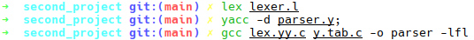

<div dir="rtl">

# پروژه دوم

## توضیحاتی درباره‌ی YACC

### نمونه کد

</div>

```c
/* Auxiliary declarations */
%{
#include <stdio.h>
#include <stdlib.h>

int yylex(void);
void yyerror(const char *s);
%}

/* Tokens */
%token NUMBER PLUS MINUS TIMES DIVIDE LPAREN RPAREN

/* Operator precedence and associativity */
%left PLUS MINUS
%left TIMES DIVIDE

%%

/* Grammar rules and actions */
expr:
    expr PLUS expr   { printf("Adding\n"); }
  | expr MINUS expr  { printf("Subtracting\n"); }
  | expr TIMES expr  { printf("Multiplying\n"); }
  | expr DIVIDE expr { printf("Dividing\n"); }
  | LPAREN expr RPAREN { /* parentheses */ }
  | NUMBER           { /* number */ }
  ;

%%

/* Auxiliary functions */
void yyerror(const char *s) {
    fprintf(stderr, "Error: %s\n", s);
}

int main(void) {
    return yyparse();
}

```

<div dir="rtl">

### Auxiliary declarations

در این قسمت از برنامه میتوان اعمال زیر را انجام داد:

- اضافه کردن کتابخانه های مورد نیاز
- تعربف کردن متغیر های سراسری
- اعلام کردن توابع کمکی

### Tokens

در این قسمت می‌توان توکن‌هایی را تعریف کرد که در ادامه از آن‌ها در قسمت قوانین استفاده شود. این توکن‌ها نشان‌دهنده عناصر اصلی زبان هستند مانند عملگرها و اعداد.

### Operator precedence and associativity

در این قسمت می‌توان تقدم و ترتیب عملگرها را مشخص کرد. ترتیب عملگرها نشان می‌دهد که عملگرها با چه ترتیبی اعمال شوند:

- دستور %left: این دستور برای تعریف عملگرهایی با انجمنی چپ‌به‌راست استفاده می‌شود. به عنوان مثال در عبارت a - b - c، عمل تفریق به صورت (a - b) - c انجام می‌شود.
- دستور %right: این دستور برای تعریف عملگرهایی با انجمنی راست‌به‌چپ استفاده می‌شود. به عنوان مثال در عبارت a = b = c، عمل انتساب به صورت a = (b = c) انجام می‌شود.

### Grammar rules and actions

در این قسمت قواعد گرامری زبان تعریف می‌شوند. هر قانون شامل یک الگو و عملی است که باید در صورت تطابق ورودی با آن الگو انجام شود.

### Auxiliary functions

در این قسمت توابع کمکی را تعریف می‌کنیم. حداقل تعریف یک تابع main الزامی است که معمولاً تابع yyparse را فراخوانی می‌کند.

### The yyfunctions

#### yyparse()

این تابع اصلی‌ترین تابع تولید شده توسط YACC است که با فراخوانی آن فرآیند پارسینگ آغاز می‌شود. اگر ورودی با قواعد گرامری تطابق داشته باشد، مقدار بازگشتی آن 0 و در غیر این صورت یک مقدار غیر صفر خواهد بود.

#### yylex()

این تابع که معمولاً توسط یک تحلیلگر لغوی مثل Lex تولید می‌شود، توکن بعدی را از ورودی می‌خواند. این تابع باید یک مقدار صحیح که نوع توکن را نشان می‌دهد برگرداند و مقدار yylval را به مقدار توکن تنظیم کند.

#### yyerror(const char *s)

این تابع زمانی که یک خطای نحوی در ورودی شناسایی شود، فراخوانی می‌شود. این تابع معمولاً یک پیام خطا را چاپ می‌کند.

## شرح پروژه

### صورت مسئله

برای یک دستور دلخواه، یک تجزیه کننده با YACC بنویسید.

### پاسخ

دستور انتخاب شده Do-While است.

</div>

#### lexer.l

```c
/* Auxiliary declarations */
%{

#include "y.tab.h"

%}

/* Rules */
%%

[ \t\n]                ;
"do"                   return DO;
"while"                return WHILE;
[0-9]+                 return NUM;
[A-Za-z][A-Za-z0-9]*   return ID;
"<="                   return LEQUAL;
">="                   return GEQUAL;
"=="                   return EQUAL;
"!="                   return NEQUAL;
"||"                   return OR;
"&&"                   return AND;
"="                    return ASSIGN;
"+"                    return PLUS;
"-"                    return MINUS;
"*"                    return MULTIPLY;
"/"                    return DIVIDE;
"<"                    return LTHAN;
">"                    return GTHAN;
";"                    return SEMCOLON;
"{"                    return LBRACE;
"}"                    return RBRACE;
"("                    return LPAR;
")"                    return RPAR;
.                      return yytext[0];

%%
```

<div dir="rtl">

1. قسمت Auxiliary declarations: این قسمت شامل دستورات C است که قبل از هر چیز دیگر توسط کامپایلر C دیده می‌شود. در اینجا، فایل هدر y.tab.h اضافه شده است که توسط YACC تولید می‌شود و شامل تعریف توکن‌ها است.
2. قسمت Rules: در این قسمت، قوائد تحلیلگر لغوی را تعریف میکنیم و در هر قانون نام توکن مربوطه را برمی‌گردانیم. مقادیر برگشتی توکن ها باید با مقادیر تعریف شده در فایل parser.y همخوانی داشته باشد.

</div>

#### parser.y

```c
/* Auxiliary declarations */
%{
#include <stdio.h>
#include <stdlib.h>

int yylex(void);
void yyerror(const char *s);

%}

/* Tokens */
%token ID NUM DO WHILE LEQUAL GEQUAL EQUAL NEQUAL OR AND ASSIGN PLUS MINUS MULTIPLY DIVIDE LTHAN GTHAN LBRACE RBRACE LPAR RPAR SEMCOLON

/* Operator precedence and associativity */
%right ASSIGN
%left OR AND
%left LTHAN GTHAN LEQUAL GEQUAL EQUAL NEQUAL
%left PLUS MINUS
%left MULTIPLY DIVIDE

/* Grammar rules and actions */
%%

program             : do_while_statement { printf("Input accepted.\n"); exit(0); }
                    ;

do_while_statement  : DO LBRACE statements RBRACE WHILE LPAR condition RPAR SEMCOLON
                    ;

statements          : statements statement
                    | statement
                    ;

statement           : expression SEMCOLON
                    ;

expression          : ID ASSIGN expression
                    | arithmetic_expression
                    | logical_expression
                    | relational_expression
                    | ID
                    | NUM
                    ;

arithmetic_expression
                    : expression PLUS expression
                    | expression MINUS expression
                    | expression MULTIPLY expression
                    | expression DIVIDE expression
                    ;

logical_expression  : expression OR expression
                    | expression AND expression
                    ;

relational_expression
                    : expression LTHAN expression
                    | expression GTHAN expression
                    | expression LEQUAL expression
                    | expression GEQUAL expression
                    | expression EQUAL expression
                    | expression NEQUAL expression
                    ;

condition           : arithmetic_expression
                    | logical_expression
                    | relational_expression
                    | ID
                    | NUM
                    ;

%%

/* Auxiliary functions */
int main() {
    printf("Enter the expression: ");
    return yyparse();
}

void yyerror(const char *s) {
    fprintf(stderr, "Error: %s\n", s);
}

```

<div dir="rtl">

1. قسمت Auxiliary declarations: در اینجا کتابخانه های مورد نظر را اضافه می‌کنیم و متود های لازم را اعلام می‌کنیم.
2. قسمت Tokens: در اینجا تمامی توکن های مورد نیاز را تعریف می‌کنیم.
3. قسمت Operator precedence and associativity: در اینجا الویت عملگرها را مشخص می‌کنیم تا از بروز ابهام جلوگیری کنیم.
4. فسمت Grammar rules and actions: در اینجا قوانین مربوط به تجزیه گر را می نویسیم. فرمت کلی دستور Do-While به شکل زیر است:

</div>

```c
do {
    statement1;
    statement2;
    statement3;
    .
    .
    .
} while (expression);
```

<div dir="rtl">

5. قسمت Auxiliary functions: در اینجا دو تابع ضروری main و yyerror را تعریف می‌کنیم.

### کامپایل



### نمونه ورودی و خروجی


</div>
